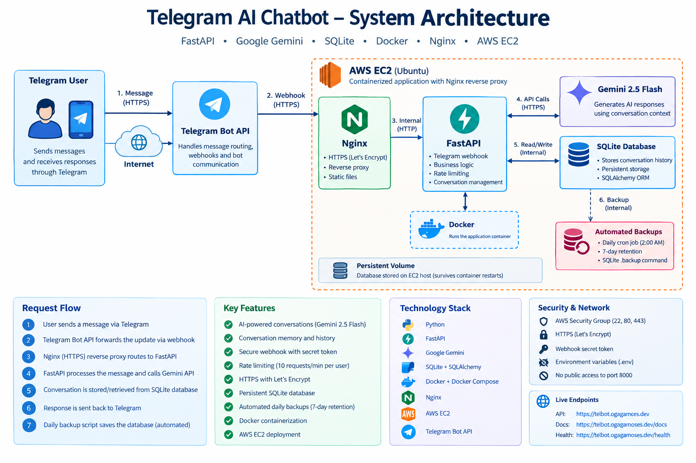

# Telegram AI Chatbot

[](https://github.com/Busybrain8/telegram-ai-chatbot/actions/workflows/ci.yml)

An AI-powered Telegram chatbot built with **FastAPI, Google Gemini, SQLAlchemy, SQLite, Docker, Nginx, and AWS EC2**.

The application provides conversational AI through Telegram while maintaining conversation history so the chatbot can use previous messages as context. It is deployed to AWS with HTTPS, a custom domain, persistent database storage, webhook security, rate limiting, and automated database backups.

## 🚀 Live Demo

**Telegram Bot:** Available through the deployed Telegram bot.

**Production API:** `https://telbot.ogagamoses.dev`

**API Documentation:** `https://telbot.ogagamoses.dev/docs`

**Health Check:** `https://telbot.ogagamoses.dev/health`

> The Telegram bot is the primary interface for interacting with the application.

---

## ✨ Features

* 🤖 AI-powered conversations using **Google Gemini 2.5 Flash**
* 💬 Telegram Bot integration
* 🧠 Persistent conversation memory
* 🗄️ SQLite database with SQLAlchemy ORM
* 🔐 Secure Telegram webhook using a secret token
* 🚦 Per-user rate limiting
* 🔄 Conversation reset functionality
* 📜 Conversation history retrieval
* ❤️ Application health-check endpoint
* 🐳 Dockerized application
* 🌐 Nginx reverse proxy
* 🔒 HTTPS with Let's Encrypt
* ☁️ AWS EC2 deployment
* 💾 Persistent database storage
* 🔁 Automated daily database backups
* 📦 Backup retention and cleanup

---

## 🏗️ Architecture



```text
                    ┌──────────────────┐
                    │      Telegram    │
                    │      User        │
                    └────────┬─────────┘
                             │
                             │ HTTPS
                             ▼
                    ┌──────────────────┐
                    │   Telegram Bot   │
                    │      API         │
                    └────────┬─────────┘
                             │
                             │ Webhook
                             ▼
              ┌──────────────────────────────┐
              │ telbot.ogagamoses.dev        │
              │                              │
              │       Nginx + HTTPS          │
              └──────────────┬───────────────┘
                             │
                             │ Reverse Proxy
                             ▼
              ┌──────────────────────────────┐
              │        FastAPI               │
              │                              │
              │  Telegram Webhook             │
              │  Rate Limiting                │
              │  Conversation Management      │
              └──────────────┬───────────────┘
                             │
                ┌────────────┴────────────┐
                │                         │
                ▼                         ▼
       ┌─────────────────┐      ┌─────────────────┐
       │     SQLite      │      │  Gemini 2.5     │
       │    Database     │      │     Flash       │
       │                 │      │                 │
       │ Conversation    │      │ AI Response     │
       │ History         │      │ Generation      │
       └─────────────────┘      └─────────────────┘
                │
                ▼
       ┌─────────────────┐
       │ Automated Backup│
       │     Script      │
       └─────────────────┘
```

### Deployment Architecture

```text
Internet
   │
   ▼
AWS EC2
   │
   ├── Nginx :443
   │       │
   │       ▼
   │   FastAPI :8000
   │       │
   │       ├── Gemini API
   │       │
   │       └── SQLite
   │
   └── Persistent ./data volume
             │
             ▼
        Database Backups
```

---

## 🛠️ Technology Stack

### Backend

* Python
* FastAPI
* Uvicorn
* SQLAlchemy

### AI

* Google Gemini
* Gemini 2.5 Flash
* Google GenAI SDK

### Database

* SQLite
* SQLAlchemy ORM

### Messaging

* Telegram Bot API
* Telegram Webhooks

### Infrastructure

* AWS EC2
* Docker
* Docker Compose
* Nginx
* Let's Encrypt / Certbot

### Development

* `uv`
* Git
* GitHub

---

## 📁 Project Structure

```text
telegram-ai-chatbot/
│
├── app/
│   ├── api/
│   │   └── telegram.py
│   │
│   ├── core/
│   │   └── rate_limiter.py
│   │
│   ├── database/
│   │   ├── database.py
│   │   └── models.py
│   │
│   ├── services/
│   │   ├── gemini_service.py
│   │   └── telegram_service.py
│   │
│   ├── utils/
│   │   └── telegram_utils.py
│   │
│   └── main.py
│
├── data/
│   └── telegram_chatbot.db
│
├── backups/
│   └── database backups
│
├── backup_database.sh
├── Dockerfile
├── docker-compose.yml
├── requirements.txt
├── .dockerignore
├── .gitignore
├── .env.example
└── README.md
```

---

## 🧠 How Conversation Memory Works

When a user sends a message:

1. Telegram sends the message to the FastAPI webhook.
2. The application identifies the user's `chat_id`.
3. The user's message is stored in SQLite.
4. Previous conversation history is retrieved from the database.
5. The conversation history is sent to Gemini as context.
6. Gemini generates the response.
7. The AI response is stored in SQLite.
8. The response is sent back to Telegram.

This allows the chatbot to maintain context across multiple messages and application/container restarts.

---

## 🔐 Security

The deployment includes several security measures:

### Telegram Webhook Secret

The webhook validates Telegram's secret header before processing requests.

```text
X-Telegram-Bot-Api-Secret-Token
```

### Environment Variables

Sensitive credentials are stored in `.env` rather than committed to Git.

Example:

```env
TELEGRAM_BOT_TOKEN=
TELEGRAM_WEBHOOK_SECRET=
GEMINI_API_KEY=
```

The `.env` file is excluded from Git using `.gitignore` and from Docker builds using `.dockerignore`.

### Network Security

The AWS EC2 security group exposes only:

```text
22   SSH
80   HTTP
443  HTTPS
```

The FastAPI application runs internally on port `8000` and is not directly exposed to the public internet.

### HTTPS

Nginx terminates HTTPS using a Let's Encrypt certificate.

---

## 🚦 Rate Limiting

The application implements per-user rate limiting to reduce excessive API requests.

Current configuration:

```python
MAX_REQUESTS = 10
WINDOW_SECONDS = 60
```

This limits a user to approximately **10 requests per minute**.

---

## 💾 Database Persistence

SQLite is stored on the EC2 host rather than inside the Docker container:

```text
./data:/app/data
```

The database therefore survives Docker container restarts and container recreation.

Database:

```text
data/telegram_chatbot.db
```

---

## 🔄 Database Backups

The project includes an automated SQLite backup script:

```text
backup_database.sh
```

Backups are created using SQLite's `.backup` command and stored in:

```text
backups/
```

Old backups are automatically removed after seven days.

A daily cron job runs the backup:

```cron
0 2 * * * /home/ubuntu/telegram-ai-chatbot/backup_database.sh >> /home/ubuntu/telegram-ai-chatbot/backups/backup.log 2>&1
```

---

## 🐳 Running Locally

### 1. Clone the repository

```bash
git clone https://github.com/Busybrain8/telegram-ai-chatbot.git
cd telegram-ai-chatbot
```

### 2. Install dependencies

Using `uv`:

```bash
uv sync
```

Or, if installing from the requirements file:

```bash
uv add -r requirements.txt
```

### 3. Configure environment variables

Create a `.env` file:

```env
TELEGRAM_BOT_TOKEN=your_telegram_bot_token
TELEGRAM_WEBHOOK_SECRET=your_webhook_secret
GEMINI_API_KEY=your_gemini_api_key
```

### 4. Run the application

```bash
uv run uvicorn app.main:app --reload
```

The API will be available at:

```text
http://localhost:8000
```

Swagger documentation:

```text
http://localhost:8000/docs
```

---

## 🐳 Running with Docker

Build and start the application:

```bash
docker compose up -d --build
```

Check the container:

```bash
docker compose ps
```

View logs:

```bash
docker compose logs --tail=100 app
```

Stop the application:

```bash
docker compose down
```

---

## ☁️ AWS Deployment

The application is deployed on an **AWS EC2 Ubuntu server**.

Production architecture:

```text
AWS EC2
│
├── Docker
│   └── FastAPI application
│
├── Nginx
│   └── HTTPS reverse proxy
│
├── SQLite
│   └── Persistent conversation database
│
└── Cron
    └── Automated database backups
```

The production API is accessed through:

```text
https://telbot.ogagamoses.dev
```

---

## 🔌 API Endpoints

| Method | Endpoint                  | Purpose                           |
| ------ | ------------------------- | --------------------------------- |
| GET    | `/health`                 | Application health check          |
| GET    | `/telegram/bot`           | Retrieve Telegram bot information |
| GET    | `/telegram/webhook-info`  | View webhook status               |
| POST   | `/telegram/webhook`       | Receive Telegram updates          |
| POST   | `/telegram/set-webhook`   | Configure Telegram webhook        |
| POST   | `/telegram/reset-webhook` | Remove Telegram webhook           |

Interactive API documentation is available through FastAPI Swagger:

```text
/docs
```

---

## 🤖 Telegram Commands

The bot supports commands such as:

```text
/start
/help
/status
/reset
/history
```

### `/start`

Starts a conversation with the bot.

### `/help`

Displays available commands and usage information.

### `/status`

Displays application/bot status information.

### `/reset`

Clears the user's conversation context.

### `/history`

Retrieves conversation history.

---

## 🧪 Testing

The project includes automated unit tests using pytest.

Run the test suite locally:

```bash
uv run pytest -v

### Health Check

```bash
curl http://localhost:8000/health
```

Expected:

```json
{
  "status": "healthy"
}
```

### Docker Logs

```bash
docker compose logs --tail=100 app
```

### Database

```bash
sqlite3 data/telegram_chatbot.db ".tables"
```

---

## ⚠️ Current Limitations

This project intentionally uses lightweight infrastructure appropriate for a portfolio deployment.

### Gemini API Quota

The application depends on Gemini API availability and applicable API quotas.

### SQLite

SQLite is suitable for this project's scale, but a larger production system could use PostgreSQL or another managed relational database.

### In-Memory Rate Limiting

Rate-limit state is stored in application memory, meaning it resets when the application restarts.

### Same-Server Backups

Database backups are currently stored on the EC2 instance. A future improvement would be copying backups to Amazon S3 for protection against instance or disk failure.

---

## 🔮 Future Improvements

Potential improvements include:

* [ ] Amazon S3 off-site database backups
* [ ] PostgreSQL migration
* [ ] Redis-based rate limiting
* [x] Automated tests with pytest
* [ ] Application monitoring and alerting
* [x] GitHub Actions CI
* [ ] Conversation analytics dashboard
* [ ] Streaming AI responses
* [ ] Multi-model support
* [ ] Retrieval-Augmented Generation (RAG)
* [ ] Admin dashboard

---

## 📸 Demo

Add screenshots or a short video demonstrating:

1. Telegram `/start`
2. Normal AI conversation
3. Conversation memory
4. `/history`
5. `/reset`
6. AWS deployment
7. Swagger API documentation

---

## 🎯 What This Project Demonstrates

This project demonstrates practical experience with:

* AI application development
* Generative AI integration
* REST API development
* FastAPI
* Telegram Bot API
* Webhook architecture
* Conversation memory
* SQL databases
* SQLAlchemy
* Docker
* Linux server administration
* Nginx
* HTTPS/TLS
* AWS EC2
* DNS and custom domains
* Environment/secrets management
* Rate limiting
* Automated database backups
* Cloud deployment

---

## 👨‍💻 Author

**Ogagaoghene Moses**

AI Engineer | Full-Stack Developer | AI Automation Engineer

GitHub: `https://github.com/Busybrain8`

LinkedIn: `https://www.linkedin.com/in/ogagaoghene-moses-6362bb168`

---

## 📄 License

This project is intended primarily as a portfolio and learning project.
